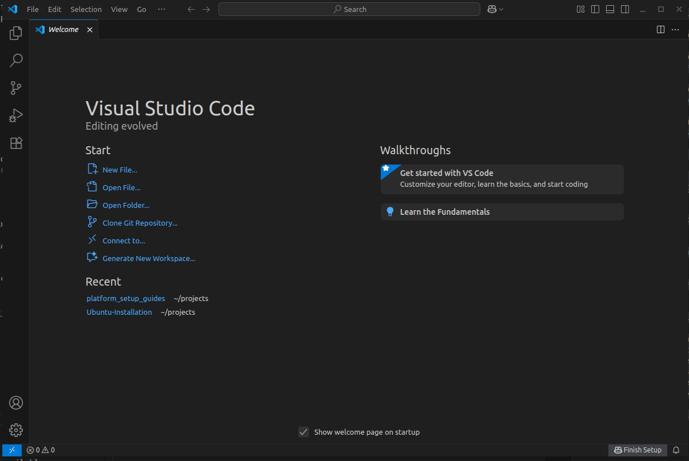
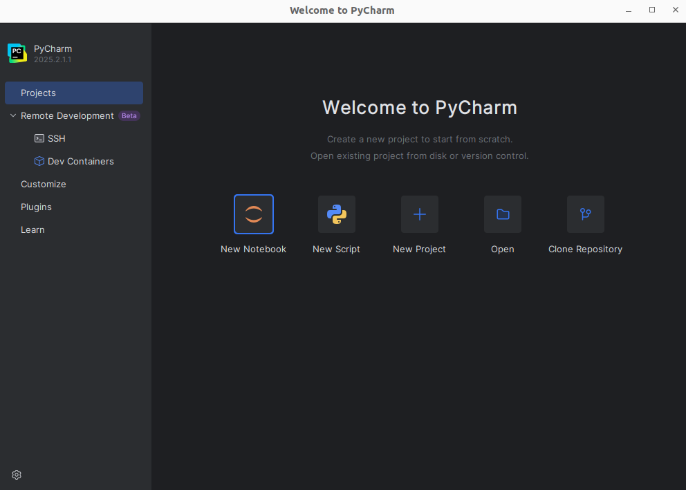

# Guide to Deep Learning Environment Setup on Ubuntu 22.04

Setting up a reliable deep learning environment is critical for training neural networks, experimenting with new models, and deploying real-world AI systems. This guide walks through the process of preparing a GPU-accelerated deep learning stack on Ubuntu 22.04.

## I. NVIDIA Driver, CUDA Toolkit, CuDNN and TensorRT Installation

To utilize the full power of NVIDA GPUs for deep learning and AI workloads on Ubuntu, it is essential to understand the rols of three core components: **NVIDIA Driver**,  **CUDA Toolkit**, and **CuDNN**.

**TensorRT** is NVIDIA's high-performance deep learning inference SDK. It is designed to **optimize**, **accelerate**, and **deploy** trained neural network, especially on NVIDIA GPUs for fast inference.

Please see the guide in [`01_setup_nvidia_driver_cuda_cudnn_and_tensorrt.md`](./01_setup_nvidia_driver_cuda_cudnn_and_tensorrt.md).

## II. Remote SSH and Tmux Installation

**SSH (Secure Shell)** is the foundation of secure remote access in Linux environments. With SSH, you can connect to a remote server's terminal over the internet or local network, allowing you to run commands, transfer files, and manage your system — all from the comfort of your local machine.

To create and manage multiple terminals in one SSH session, **Tmux (Terminal Multiplexer)** is a powerfull command-line tool to deal with. It also support keeping processes running **even if SSH disconnects**.

Please see the guide in [`02_setup_remote_ssh.md`](./02_setup_remote_ssh.md) and [`03_manage_remote_sessions_with_tmux_and_ssh.md`](./03_manage_remote_sessions_with_tmux_and_ssh.md).

## III. Miniforge3 Installation

[**Miniforge3**](https://github.com/conda-forge/miniforge/) is a lightweight Conda installer based on the conda-forge community packages (instead of Anaconda’s defaults). 

**Mamba** is a fast alternative to Conda, built in C++ — it dramatically speeds up environment creation, solving, and package installs.

When you install **Miniforge3** with **Mamba**, you get:

- **Conda** (the classic environment and package manager).
- **Mamba** (a drop-in, faster replacement for Conda).
- Only *clean*, *open-source* packages from *conda-forge*.

Please see the guide in `04_setup_python_environment.md`.

## IV. Visual Studio Code (VS Code) Installation

**VS Code** is a free, cross-platform and modern code editor from Microsoft with rich language support, debugging, Git integration, and a huge extensions ecosystem. It is:

- Lightweight yet powerful — opens instantly.
- Built-in terminals, editors, and debuggers.
- First-class support for Python, JavaScript, C/C++, Go, Rust, and many more.
- Extensions for Jupyter, Docker, Remote SSH, GitLens, CUDA/C++, and frameworks like PyTorch/TensorFlow.

**VS Code** can be installed via the Microsoft's `.deb` package.

```sh
wget https://update.code.visualstudio.com/latest/linux-deb-x64/stable -O vscode.deb
```

Install the downloaded `.deb` package using `dpkg` command.

```sh
sudo apt dpkg -i vscode.deb
```

Then open the **VS Code** and ready to use.



## V. PyCharm Installation

**PyCharm** is a full-featured Python IDE from JetBrains, available in **Community** (free) and **Professional** (paid) editions. It is:

- Deep code insight: smart completion, on-the-fly error checking.
- Integrated debugger and test runner.
- Built-in support for virtual environments, Conda, Docker, and SSH interpreters (**Professional**).
- Excellent support for web frameworks (Django, Flask), scientific tools, and notebooks (**Professional**).

**NOTE:** If you are student or educator, you can use the **Professional** edition by **Education Subcription**.

**PyCharm** can be installed via **Tarball** from JetBrain website.

1. Download the `tar.gz` from [https://www.jetbrains.com/pycharm/download/](https://www.jetbrains.com/pycharm/download/) and then extract it.

```sh
sudo mkdir -p /opt/pycharm

sudo tar -xzf pycharm-*.tar.gz -C /opt/pycharm --strip-components 1
```

Launch **PyCharm**.

```sh
cd /opt/pycharm/bin && ./pycharm
```



Initiate configuration.

- First Launch Wizard:
    - Import settings or fresh start.
    - Choose UI theme (Light/Dark).
- Create Desktop Entry:
    - In the *Welcome* window → select the **⚙** icon in the bottom-left corner → select *Create Desktop Entry...*.

## VI. AI Framework Setup

Before start training AI model, you can install he high-level AI framework (PyTorch/Tensorflow) that allows you to design, train, and deploy sophisticated models with remarkable efficiency.

Open your IDE's terminal or new system terminal, create and activate the DL environment.

```sh
mamba activate dl_env
```

Install PyTorch or Tensorflow. Please check the installation in [here](https://pytorch.org/get-started/locally/) or [here](https://www.tensorflow.org/install).

### Verification - Confirm Your GPU is Ready

Before you start training, run one final check inside your activated `mamba` environment. Open your IDE's terminal or a new system terminal (`mamba activate your_dl_env`) and run this simple Python snippet:

**For PyTorch:**

```python
import torch
if torch.cuda.is_available():
    print(f"Success! PyTorch is using GPU: {torch.cuda.get_device_name(0)}")
else:
    print("Installation issue: PyTorch cannot find the GPU.")
```

**For Tensorflow:**

```python
import os
os.environ["TF_ENABLE_ONEDNN_OPTS"] = "0"

import tensorflow as tf
if tf.config.list_physical_devices("GPU"):
    print("Success! TensorFlow has detected the GPU.")
else:
    print("Installation issue: TensorFlow cannot find the GPU.")
```

The output should be `Success!`.

## Conclusion

The setup is complete. It provides performance, stability, and—most importantly—reproducibility. You can now confidently share your work, knowing that the environment can be precisely replicated.

Now it's time to create, innovate, and solve challenging problems. Happy training!